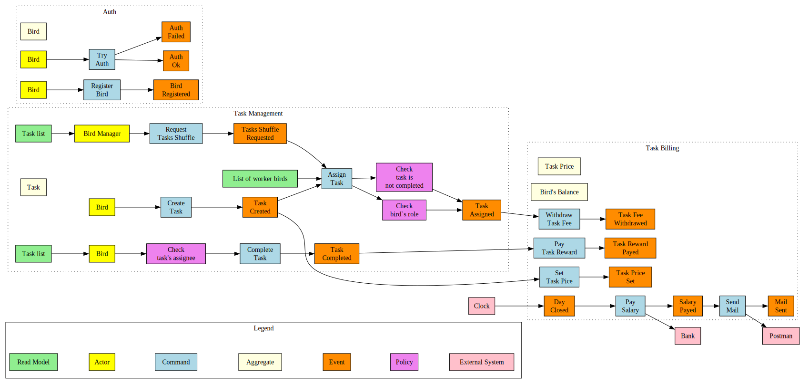
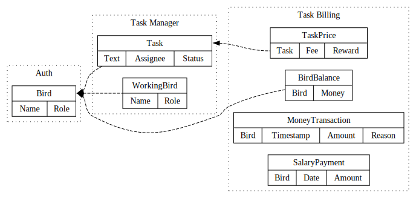
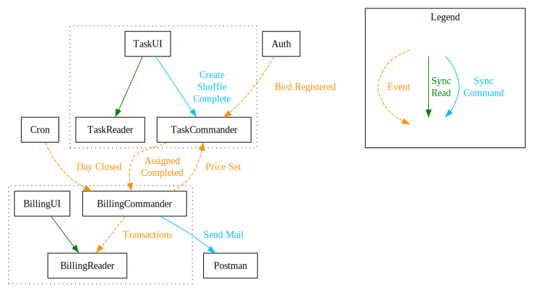

## Event Storming
В результате анализа требований получили такие цепочки бизнес-событий:

Бизнес-события можно сгруппировать в три контекста:

  - **Auth** − всё, что связано с управлением пользователями.
  - **Task Management** − просмотр задач и управление задачами.
  - **Task Billing** − оценка задач, выплата денег за их выполнение,
    финансовые отчёты.

## Модель данных
Ниже схематично показаны основные данные для каждого контекста и примерные связи
между ними.

## Сервисы
В контекстах **Task Management** и **Task Billing** предлагается отделить чтение
данных от выполнения команд, поэтому в каждом будет три сервиса: `*UI`,
`*Reader` и `*Commander`.

> **NB:** Аналитика не является отдельным сервисом, она внутри `BillingReader`.

## CUD-события
Они же *Event-Carried State Transfer*. С помощью них сервисы поддерживают в
актуальном состоянии локальные копии нужных им данных.

На прошлой схеме отображены бизнес-события и команды, на ней нет CUD-событий.
В первую очередь на CUD-события подписываются `TaskReader` и `BillingReader` −
через эти сервисы пользователи получают информацию о состоянии и событиях в
системе.

Сервису `TaskCommander` требуется список пользователей для случайного
переназначения задач, этот список так же поддерживается в актуальном состоянии
с помощью CUD-событий.

Ниже в таблице указаны только получатели, которые используют событие не для
запуска команды, а для репликации данных.

| Событие                 | Кто отправляет   | Кто получает              |
|------------------------ |------------------|---------------------------|
| Bird Registered         | Auth             | TaskCommander             |
| Task Created            | TaskCommander    | TaskReader                |
| Task Assigned           | TaskCommnader    | TaskReader, BillingReader |
| Task Completed          | TaskCommnader    | TaskReader, BillingReader |
|                         |                  |                           |
| Task Price Set          | BillingCommander | TaskReader, BillingReader |
| Task Fee Withdrawed     | BillingCommander | BillingReader             |
| Task Reward Payed       | BillingCommander | BillingReader             |
| Salary Payed            | BillingCommander | BillingReader             |
