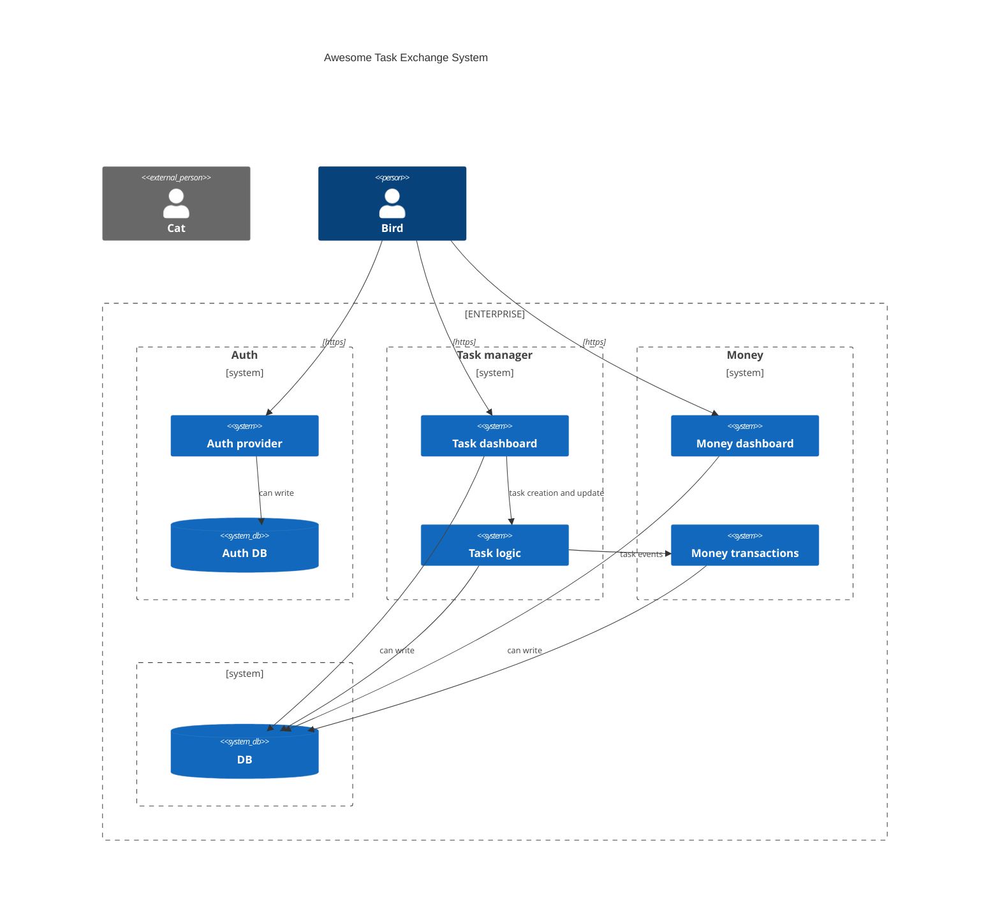
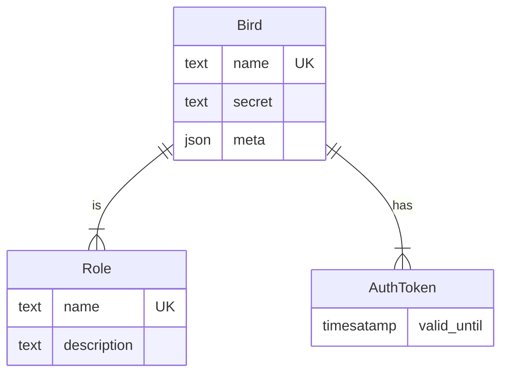
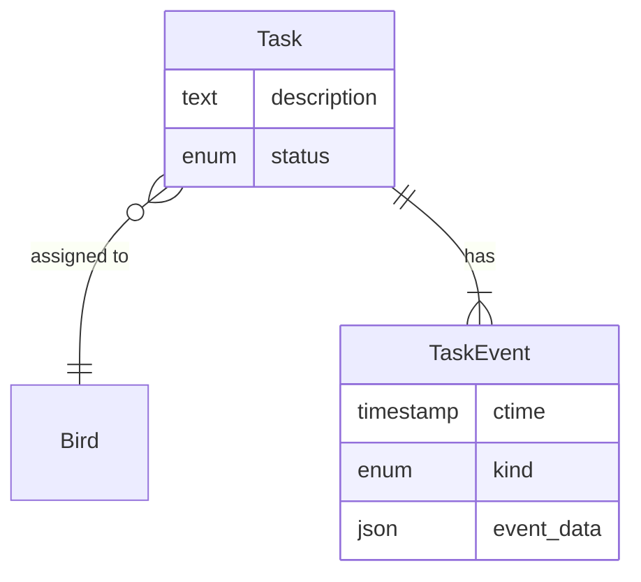
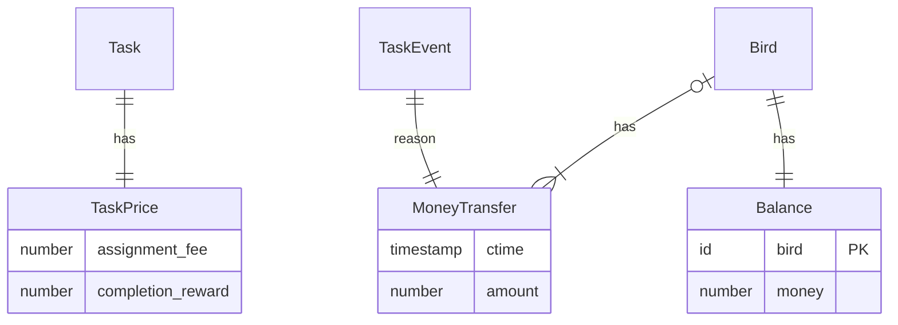

# :parrot: + :computer: => :dollar:

Система сочетает в себе элементы таск трекера, лотереи и биллинга.

## Ограничения и допущения

При проектировании мы исходили из следующих оценок:
  - пользователи системы: до 5000 :parrot:
  - задачи: до 100к :hammer: в день
  - **=>** до 1м :dollar: финансовых транзакций в день (в пике до 1000 в минуту)
  - **=>** каждый день до 2Gb данных пишется в БД

Нет экстраординарных требований к доступности. 99% uptime is fine. 80% запросов должно обрабатываться течение 1 сек.

Данные хранятся в оперативной БД в течение 5 лет, потом требования к доступности снижаются.

## Сервисы

Подход к проектированию системы выбран в соответствии с [законом Конвэя](https://en.wikipedia.org/wiki/Conway%27s_law): разными сервисами занимаются разные команды и микросервисная архитектура позволяет им меньше общаться, разрабатывать и деплоить независимо друг от друга.

Возможно это позволит изолировать влияние ошибок и адаптироваться к изменениям требований и нагрузки.

Выделены зоны ответственности команд разработчиков в соответствии с предметной областью:
  - задачи
  - деньги
  - БД и служебная инфраструктура

#### Task dashboard
Предоставляет птицам интерфейс для просмотра и управления задачами. Из БД только читает — можно переключиться на реплику для снижения нагрузки на основную БД или в случае проблем. Для изменения задач отправляет асинхронные запросы к `Task logic`.

#### Task logic
Реализует операции связанные с созданием и изменением задач. Оповещает `Money transactions` о релевантных событиях.
Выделение этой функциональности в отдельный сервис позволяет обновлять логику не прекращая read/only доступ к задачам.

#### Money dashboard
Предоставляет птицам интерфейс для просмотра финансовой информации в соответствии с их полномочиями. Имеет доступ к БД только на чтение.

#### Money transactions
Реагирует на события, влияющие на финансовую успешность попугаев. У этого сервиса повышенные требования к производительности и надёжности.

## Основные функции сервисов и схема данных

#### Auth
  - получить/обновить токен
  - получить/обновить метаинформацию о птице

#### Task dashboard 
  - создать задачу
  - посмотреть задачи
  - отметить выполнение задачи
  - переназначить ответственных рандомно

Переназначение задач выполняется асинхронно. Поскольку процесс рандомный, нет проблем, если менеджер нажимает кнопку даже если предыдущее переназначение не закончилось.

Отправляет уведомления в сервис `Money transactions` чтобы тот назначил цену или обновил балансы.

#### Money Transactions
   - оценить задачу
   - списать деньги за назначение задачи
   - зачислить деньги за выполнение задачи
   - обработать необработанные сообщения об изменениях задач

На тайном совете техлидов (см. [здесь](./design-decisions.md)) было решено, что оценка происходит асинхронно. Следствием этого является то, что в случае сбоя в этом сервисе в БД могут остаться задачи без назначенной стоимости. Важно периодически их искать и обрабатывать.

#### Money Reports
   - баланс работника
   - баланс компании
   - статистика доходов по дням

**TODO**: схемы нет

## Надёжность и реагирование на отказы
Всё помещается на одной машинке и проблемы с сетью не влияют на консистентность данных.

Для обеспечения отказоустойчивости используется hot standby failover.

### Отказы сервисов
  - Task dashboard:
    - Птицы не получают доступ к задачкам — ничего страшного если укладываемся в SLA, подождут немного.

  - Task logic:
    - Птицы не могут создавать и обновлять задачи, менеджеры не могут переназначать. Всё остальное работает.

  - Money transactions:
    - Замирает обновление балансов.
        - Теряются уведомления о переназначении ответственного, но это не страшно — сервис периодически находит необработанные переназначения в БД и формирует платёжные транзакции для них.
    - Замирает создание задач из-за невозможности их оценить.
        - Попугаи видят только что созданные задачи со статусом "Сохраняем".

  - Money dashboard:
    - Ничего страшного, бухгалтер подождёт.

  - Auth:
    - Попугаи не могут залогиниться или теряют сессию. Залогиненные попугаи могут не заметить downtime в несколько минут, если у токена достаточное время жизни.

  - При отказе БД ничего не работает, просто ждём.

  Отказы влияют на доступность сервисов, но не вляюят на согласованность данных.
